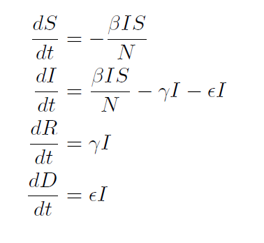
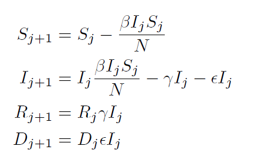
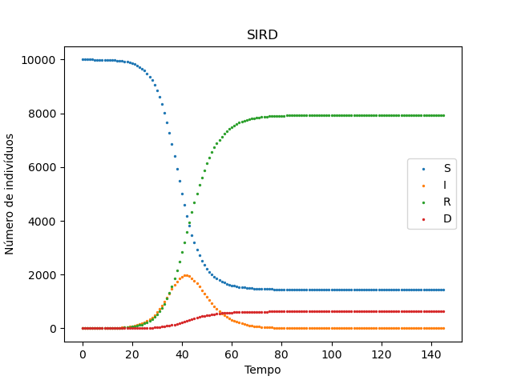
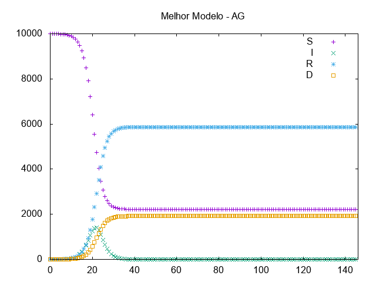

# Genetical Algorithm for Epidemic Model parameter ajusting

## The Epidemic Model
When studing an epidemic, many models can be used to describe the disease evolution.
The most common ones are from the SIR family, that divide the total population in groups accordingly to the dynamics of the disease.
These dynamics can be as complex and precise as one wishes, and the parameter fitting of the model can get very complex to do.
So here we propose to use a genetical algorithm to make this parameter ajusting in one of theese models, called the SIRD model.

The SIRD model divides the total population in four groups: The ones who are susceptible to get the disease belong to the "Susceptible" group.
The ones that are curently with the disease and can infect others belongs to the "Infected" or "Infectious" group.
The ones recovered from de disease belongs to the "Recovered" group. And the ones that died from the disease belong to the "Dead" group.
In the SIRD model, we use the letters "S", "I", "R" and "D" to represent the number of people in each group, respectively,
and the dynamics of the model consists of some individuals from "S" going to "I" and then going to "R" or "D".
To represent the rate which theese transitions happen, there are used three parameters β, γ and ε that indicates the rate from "S" to "I", from "I" to "R" and from "I" to "D".
The model and the transitions can de visualized in the equations and the picture bellow:

### SIRD Diagram

 

### SIRD Model

 

### SIRD Discrete Model

 

## Reference data
The program can be used to ajust parameters for any data input, and our wishes was to use it for Covid-19 disease, but with real data the algorithm's evolution would not be seen very clear, so the reference data used was generated by a script, thata can be found [here](./scripts/SIRD-reference.py).
The reference series used have β = 0.45, γ = 0.19 and ε = 0.015, and to simulate real data, the Genetical Algorithm uses just the "Total Cases" and the "Number of Deaths" series.

 

## Program Usage
After dowloading the source coded from GitHub, the project compilation can be done via "make" using the "make all" command, and the execution can be done using "make run".
The compilation and running can also be done manually for the files [main.c](main.c), [model.c](model.c) and [series.c](series.c), with a C Compiler of your choice, but here the project was tested only with GCC.
The program has no dependency of any external C library, but it needs GNUPlot installed on the PC's terminal, because it's used to plot the result image.

## Video
A video (in portuguese) explaining the poject can be found here

## Results

 

Parameters found: β = 0.460017, γ = 0.198219 and ε = 0.015623
